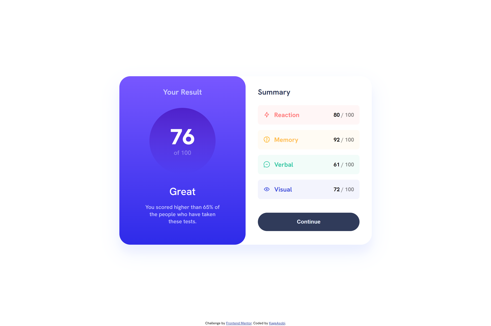
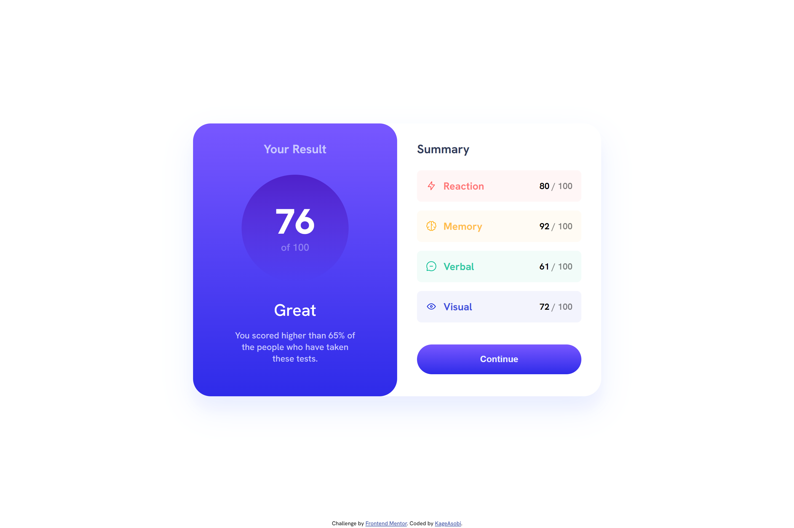
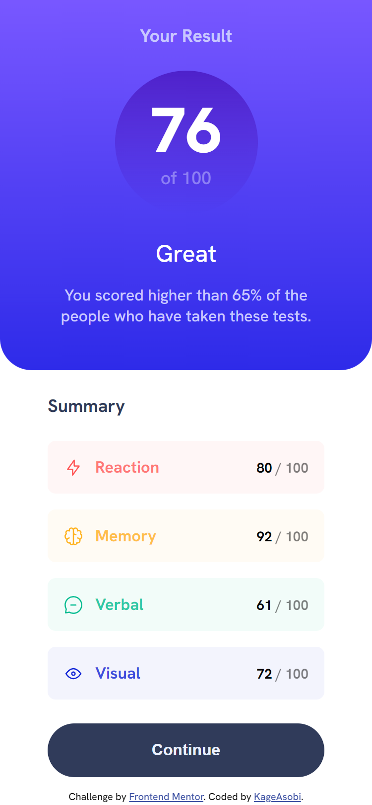
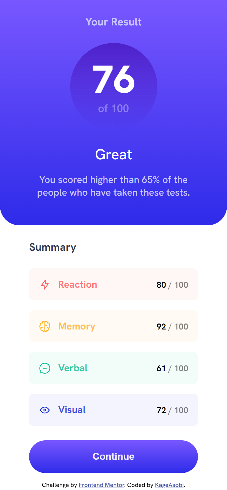

# Frontend Mentor - Results Summary Component Solution

This is a solution to the [Results Summary Component challenge on Frontend Mentor](https://www.frontendmentor.io/challenges/results-summary-component-CE_K6s0maV). Frontend Mentor challenges help you improve your coding skills by building realistic projects. 

## Table of contents

- [Overview](#overview)
  - [The challenge](#the-challenge)
  - [Screenshot](#screenshot)
  - [Links](#links)
- [My process](#my-process)
  - [Built with](#built-with)
- [Author](#author)

## Overview

### The challenge

Users should be able to:

- View the optimal layout for the interface depending on their device's screen size
- See hover and focus states for all interactive elements on the page

### Screenshot

### Links

- [Solution](https://github.com/KageAsobi/results-summary-component)
- [Live Site](https://kageasobi.github.io/results-summary-component)

## My process

### Built with

- HTML5
- CSS3
- Flexbox
- CSS Grid
- [Vite](https://vitejs.dev/)

## Author

- Frontend Mentor - [@KageAsobi](https://www.frontendmentor.io/profile/KageAsobi)
- Twitter - [@Kage_Asobi](https://twitter.com/Kage_Asobi)
